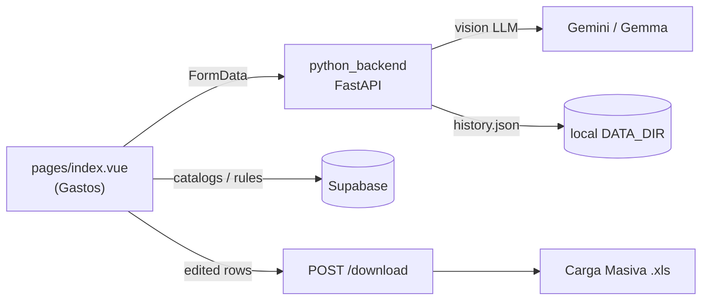

# Scan Logging, Task Sessions & Analytics Plan

Plan to instrument receipt scanning so we can audit user behavior, measure AI determinism across retries, and persist accepted results for spending-trend analytics.

---

## 1. Current software architecture & patterns

### System style

| Name | How it shows up here |
|------|----------------------|
| **Multi-tier / layered architecture** | Browser (Nuxt/Vue) → application APIs (Nitro + FastAPI) → data (Supabase/Postgres + local files). |
| **BFF + sidecar AI service** | Nuxt Nitro handles auth, team, templates, and Supabase writes. Receipt OCR/extraction is a separate FastAPI service (`python_backend`) called directly from the browser via `NUXT_PUBLIC_API_BASE`. |
| **Jamstack / SPA-first frontend** | Nuxt 3 app with Supabase client, session-held scan state, Excel export as the primary output. |
| **Backend-for-Frontend (partial)** | Nitro `server/api/**` for team/auth/admin; **not** used for the main scan pipeline today. |
| **Multi-tenant SaaS data model** | Organizations → clients → catalogs/rules; RLS on Postgres; roles (`user_profiles`, `superadmins`). |

### Application & API patterns

| Name | How it shows up here |
|------|----------------------|
| **RESTful HTTP API** | FastAPI routes: `POST /upload`, `POST /upload-batch`, `POST /download`, `POST /scan-suplidores`. |
| **Composable / hooks pattern** | Vue composables (`useClients`, `useOrganization`, `useApiBase`, `useClientDocuments`, …). |
| **Repository / data-access via SDK** | Supabase JS client as the data access layer (no custom ORM). |
| **Middleware / interceptor** | Nuxt global auth middleware (`middleware/auth.global.ts`); FastAPI CORS middleware. |
| **Feature flags** | Runtime config `features.auth` / `features.team` via `useFeatureFlags()`. |
| **Service-role / privileged admin path** | Nitro team routes use Supabase secret key after app-level authorization (`server/utils/supabaseAdmin.ts`, `teamAuthorization.ts`). |

### AI / document-processing patterns

| Name | How it shows up here |
|------|----------------------|
| **Document AI / vision-LLM extraction** | Gemini / Gemma ingest receipt images/PDF pages and return structured JSON. |
| **Prompt enrichment / RAG-lite context** | Client catalogs, business rules, and tax-column mappings are sent with each scan to steer the model. |
| **Human-in-the-loop (HITL)** | AI fills `editableData`; users correct fields before export. |
| **Client-side preprocessing** | PDF page-split / rasterization in the browser before upload (`pdfjs-dist`). |
| **Content-addressed identity** | `calculate_file_hash` on upload bytes — natural key for “same document scanned again.” |
| **Batch vs single processing** | `/upload-batch` (Flash Lite) vs `/upload` (Gemma) — different models per path. |
| **Ephemeral session state** | Scan progress lives in Vue memory only (“session-only, not persisted”). |

### Data & observability patterns (partial / unused)

| Name | How it shows up here |
|------|----------------------|
| **Event / activity sourcing (schema only)** | `activity_logs` + `field_edited` / `exported` enums exist in `backups/schema.sql` but are never written by the app. |
| **Document + report aggregate** | Unused `documents` / `reports` tables — intended finalized extraction + export batch. |
| **Local append-only history** | `python_backend` `history.json` — ops/debug, not analytics-grade. |
| **Product analytics** | PostHog (sessions / replay); not structured scan metrics. |

### Patterns this plan introduces

| Name | Purpose |
|------|---------|
| **Job / task session (work unit)** | `scan_tasks` groups many scan attempts over the same uploaded set. |
| **Attempt / run logging** | `scan_attempts` = one row per AI call (retry-safe audit + variance analysis). |
| **CQRS-lite (write models)** | Attempts = immutable audit trail; `documents` = accepted business facts for trends. |
| **Audit logging / field-level diff** | Persist `editableData` vs AI `raw_response` into `activity_logs.diff`. |
| **Finalize / commit boundary** | Explicit transition `in_progress → finalized \| discarded` before dropping session state. |
| **Determinism / reproducibility analysis** | Diff `raw_response` across attempts with the same `(task_id, file_hash)`. |

---

## 2. Goals

1. **Log scans & edits** — who scanned what, how many times the same document was re-scanned, which fields were changed after AI extraction.
2. **Treat a batch as a task** — e.g. “user uploaded 30 pages” is one `scan_task`; retries (bad result, server error, re-evaluate) are additional `scan_attempts` under that task.
3. **Measure AI determinism** — quantify how much extracted fields vary across repeated runs of the same inputs.
4. **Finalize accepted results** — before discard, optionally persist clean accepted rows for long-term spending-trend (“big data”) analysis.

---

## 3. Current flow (baseline)



- Results live in browser memory (`editableData` / `originalData`).
- Export = Excel download; **no Postgres write** of gastos extractions.
- Retries overwrite in-memory state; prior AI outputs are lost for analytics.
- Suplidores flow is the only scan path that upserts structured results to Supabase.

---

## 4. Target data model

### 4.1 `scan_tasks` (new) — the work unit / recurso

One row per upload session (e.g. the 30-page batch).

| Column | Notes |
|--------|--------|
| `id` | UUID PK |
| `organization_id`, `client_id`, `user_id` | Tenancy + actor |
| `status` | `in_progress` \| `finalized` \| `discarded` |
| `source_summary` | Optional jsonb (file count, names, total pages) |
| `created_at`, `finalized_at` | Lifecycle |

**Lifecycle:** created when the user starts a batch / first Process All; closed on finalize or discard.

### 4.2 `scan_attempts` (new) — one AI call

| Column | Notes |
|--------|--------|
| `id` | UUID PK |
| `task_id` | FK → `scan_tasks` |
| `organization_id`, `client_id`, `user_id` | Denormalized for RLS / queries |
| `file_hash` | From existing `calculate_file_hash` |
| `file_name`, `page_number` | Identity within the batch |
| `model` | e.g. `gemma-4-26b-a4b-it` vs `gemini-3.1-flash-lite` |
| `endpoint` | `upload` \| `upload-batch` |
| `prompt_snapshot` | jsonb: catalogs, rules, tax mapping sent that call |
| `raw_response` | jsonb: unedited AI output |
| `attempt_number` | nth attempt for this `file_hash` within the task |
| `duration_ms`, `error` | Ops / reliability |
| `created_at` | |

**Repeat-scan detection:**

```sql
SELECT file_hash, count(*) AS attempts
FROM scan_attempts
WHERE task_id = :task_id
GROUP BY file_hash
HAVING count(*) > 1;
```

**Determinism / variance:**

```sql
-- Group attempts of the same page within a task and compare raw_response fields
SELECT task_id, file_hash, attempt_number, raw_response
FROM scan_attempts
WHERE task_id = :task_id
ORDER BY file_hash, attempt_number;
```

### 4.3 Revive `documents` + `reports` (existing, unused)

- **`reports`** — one export / finalize batch (name, `export_file_url`, org/client).
- **`documents`** — accepted extraction rows: `data jsonb` = final (possibly user-edited) payload; link `report_id`, optionally `scan_attempt_id` / `task_id` (add FKs via migration).

Only **finalized** tasks write here. Discarded / in-progress attempts stay in `scan_attempts` only.

### 4.4 Revive `activity_logs` (existing, unused)

On user field edits (and on export/finalize):

| Field | Value |
|-------|--------|
| `entity_type` | `document` (extend enum if needed for `scan_attempt` / `scan_task`) |
| `entity_id` | document or attempt id |
| `action` | `field_edited` \| `exported` \| `status_changed` |
| `diff` | jsonb: `{ field, from, to }` (or list of changes) |
| `note` | Optional human context |

Client already computes edit diffs (`editableData` vs `originalData` in `pages/index.vue`). Persist that instead of using it only for UI badges.

---

## 5. Separation of concerns (CQRS-lite)

| Store | Mutability | Purpose |
|-------|------------|---------|
| `scan_attempts` | Append-only | Every AI call — audit, retries, determinism research |
| `activity_logs` | Append-only | User edits & status transitions |
| `documents` (+ `reports`) | Write on finalize | Clean accepted facts for spending trends over time |

Do **not** treat attempt logs as the trend dataset. Trends should use finalized `documents` only.

---

## 6. Write-path options

Scanning today bypasses Nitro (browser → FastAPI). Two options:

### Option A — FastAPI writes attempts (recommended for attempts)

- `python_backend` already has file hash, model, raw response, and duration in scope.
- Write `scan_attempts` with a Supabase service-role / DB connection from the backend.
- Pass `task_id` (and auth context) from the UI as form fields on `/upload` and `/upload-batch`.

### Option B — Nitro proxy for all scan traffic

- New `server/api/scan/**` proxies to FastAPI and owns all DB writes.
- Cleaner single gate for RLS/org checks; larger change (today Nuxt is not on the scan path).

**Recommended split:**

- **Attempts** → Option A (FastAPI).
- **Task create / finalize / field-edit logs** → Nitro (`server/api/scan-tasks/**`) so tenancy matches team/settings patterns.

---

## 7. UI / product flow changes

1. **Start task** — when user selects client + adds files / clicks Process All → `POST` create `scan_task` → keep `task_id` in session state.
2. **Every Process / Retry / Reevaluate** — send `task_id`; backend inserts `scan_attempts` with incremented `attempt_number` per `file_hash`.
3. **Edits** — on blur/commit (or before export), write `activity_logs` with `field_edited` + `diff`.
4. **End of task** — before leaving / discarding:
   - **Finalize** → create `reports` + `documents` from accepted rows; set `scan_tasks.status = finalized`.
   - **Discard** → set `discarded`; keep attempts for variance analysis; do not write `documents`.
5. Keep Excel download as today; finalize is an additional, explicit “save accepted results” step.

---

## 8. Analytics questions this unlocks

| Question | How |
|----------|-----|
| Are users scanning the same pages over and over? | `scan_attempts` grouped by `file_hash` / `task_id` |
| Which fields does the AI get wrong most often? | `activity_logs` where `action = field_edited`, aggregate by field |
| How deterministic is the model? | Diff `raw_response` across attempts with same hash + similar `prompt_snapshot` |
| Does batch vs individual model differ? | Filter by `model` / `endpoint` |
| Spending trends over time? | Query finalized `documents.data` by client / org / date fields inside jsonb |

---

## 9. Implementation phases

### Phase 1 — Schema

- Migration: `scan_tasks`, `scan_attempts`, FKs, RLS policies.
- Optionally add `task_id` / `scan_attempt_id` to `documents`.
- Confirm / extend `activity_logs` enums if needed.
- Regenerate `types/database.types.ts`.

### Phase 2 — Attempt logging

- Pass `task_id` from UI to FastAPI.
- Insert `scan_attempts` on `/upload` and `/upload-batch` (success and failure).
- Snapshot model name + prompt inputs.

### Phase 3 — Task lifecycle + edits

- Nitro APIs: create task, finalize, discard.
- Persist field edits to `activity_logs`.
- Wire leave/discard UX to status updates.

### Phase 4 — Finalize for trends

- On finalize: write `reports` + `documents` with accepted payloads.
- Retention policy for raw attempts (keep for analysis for N days/months; finalized docs longer).

### Phase 5 — Analysis surfaces (later)

- Internal dashboard or SQL views: retry rates, field-edit rates, inter-attempt variance, spending aggregates.

---

## 10. Design hooks already in the codebase

1. Unused `documents` / `reports` / `activity_logs` (+ `field_edited`, `exported`).
2. `calculate_file_hash` in `python_backend/server.py`.
3. Model split individual vs batch — must be logged for fair variance.
4. Prompt inputs (catalogs, comments, business rules, tax mapping) already sent as form fields — snapshot per attempt.
5. Client-side `originalData` vs `editableData` for edit diffs.

---

## 11. Non-goals (for this plan)

- Replacing Excel export as the primary user deliverable.
- Storing raw receipt images long-term in this phase (hashes + metadata are enough for determinism; image retention can be a follow-up).
- Using PostHog as the system of record for scan attempts (structured Postgres remains source of truth).

---

## 12. Open decisions

1. **Retention:** How long to keep `scan_attempts` / raw responses vs finalized `documents`?
2. **Image storage:** Persist source files in Supabase Storage for true reproducibility, or hash-only?
3. **Edit logging granularity:** Every keystroke vs commit-on-blur vs snapshot-at-export?
4. **Auth on FastAPI writes:** Service role from backend vs JWT forwarded from Nuxt?
5. **Enum extension:** Add `scan_task` / `scan_attempt` to `activity_entity_type`, or always log against `document`?

---

*Related code: `pages/index.vue`, `python_backend/server.py`, `composables/useApiBase.ts`, `backups/schema.sql` (`documents`, `reports`, `activity_logs`).*
